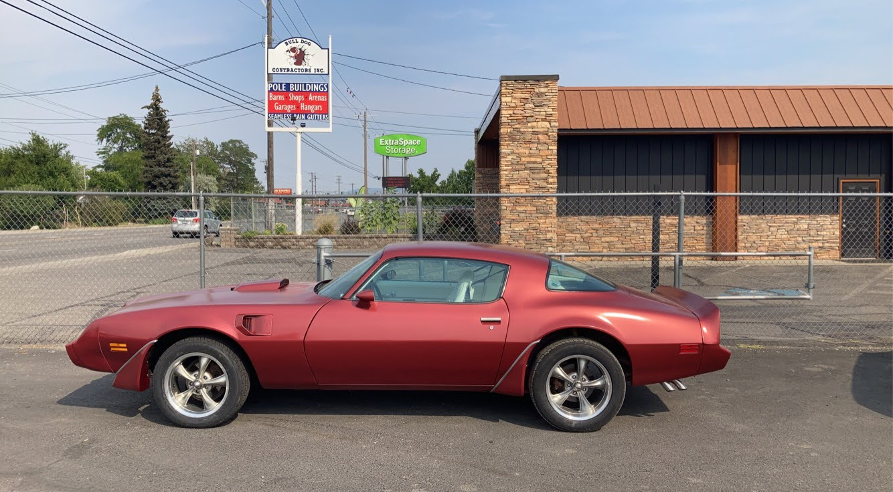

# The Iconic 1979 Pontiac Trans Am: A Timeless Classic

*Estimated reading time: 3 minutes*

The 1979 Pontiac Trans Am holds a special place in the hearts of car enthusiasts. With its sleek design, powerful engine, and undeniable charm, it has become a timeless classic that continues to captivate automotive enthusiasts even today.

## Design and Styling

The Trans Am's design is an epitome of the '70s muscle car era. Its aggressive stance, iconic front grille, and prominent hood scoop make it instantly recognizable on the road. The aerodynamic body lines and sleek curves not only enhance its aesthetics but also improve its performance.

## Performance and Power

Under the hood, the 1979 Trans Am boasts a formidable V8 engine, delivering raw power to the driver's command. With its 6.6-liter V8 engine producing up to 220 horsepower, it offers an exhilarating driving experience. The Trans Am's power is further enhanced by its advanced suspension system, providing exceptional handling and control.

## Pop Culture Phenomenon

The 1979 Pontiac Trans Am gained immense popularity and achieved iconic status through its prominent appearance in movies and television shows. Most notably, it was featured as the iconic car "KITT" in the hit TV series "Knight Rider," adding to its already impressive reputation.

## Interior and Comfort

Step inside the Trans Am, and you'll be greeted by a spacious and comfortable cabin. The interior features premium materials, offering a luxurious feel while maintaining its classic appeal. The driver-oriented cockpit, with its well-placed controls and ergonomic design, provides a truly immersive driving experience.

## Collectibility and Value

As the years have passed, the 1979 Trans Am has become a sought-after collector's item. Its iconic status and limited production numbers have contributed to its increasing value in the automotive market. Owning a well-preserved Trans Am from this era is not only a testament to its timeless appeal but also an investment in automotive history.

## Conclusion

The 1979 Pontiac Trans Am remains a symbol of American muscle and automotive excellence. Its timeless design, powerful performance, and iconic status have made it an enduring classic. Whether you're a car enthusiast or simply appreciate automotive history, the 1979 Trans Am is a must-see and must-drive machine. Take a journey back in time and experience the thrill of this legendary car for yourself.

*Thank you for reading!*

